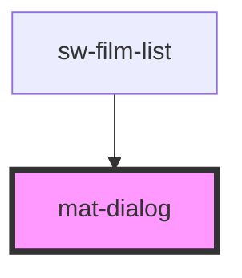

# my-component

<!-- Auto Generated Below -->

## Properties

| Property      | Attribute      | Description                       | Type      | Default     |
| ------------- | -------------- | --------------------------------- | --------- | ----------- |
| `dialogTitle` | `dialog-title` | The Dialog Title                  | `string`  | `undefined` |
| `showFooter`  | `show-footer`  | Whether to show the footer or not | `boolean` | `false`     |

## Methods

### `openDialog() => Promise<void>`

#### Returns

Type: `Promise<void>`

## Dependencies

### Used by

 - [sw-film-list](..\sw-film-list)

### Graph

----------------------------------------------

*Built with [StencilJS](https://stenciljs.com/)*
