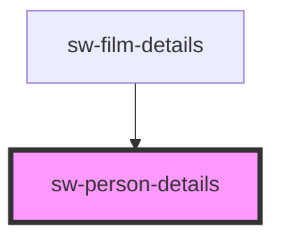

# sw-person-details

<!-- Auto Generated Below -->

## Properties

| Property   | Attribute   | Description            | Type     | Default     |
| ---------- | ----------- | ---------------------- | -------- | ----------- |
| `personId` | `person-id` | The id for the person  | `number` | `1`         |
| `url`      | `url`       | The URL for the person | `string` | `undefined` |

## Events

| Event               | Description | Type               |
| ------------------- | ----------- | ------------------ |
| `openPersonDetails` |             | `CustomEvent<any>` |

## Dependencies

### Used by

 - [sw-film-details](..\sw-film-details)

### Graph

----------------------------------------------

*Built with [StencilJS](https://stenciljs.com/)*
